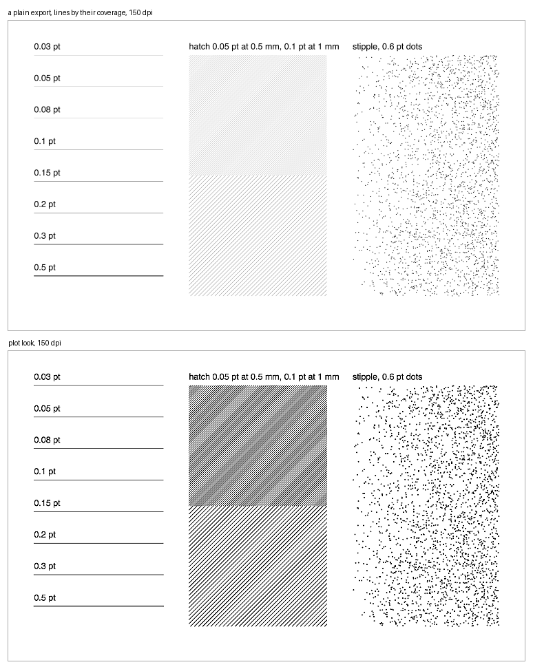

# plot look

Renders the pages of a PDF drawing to PNG as they look plotted on a toner plotter and seen from a few feet away, for portfolio pages and screens. A plain export draws each line by its coverage, so hairlines fade and fine hatching turns to grey. A plotter prints every line at least one of its pixels wide, and its toner spreads. plot look renders the page the way the plotter prints it, then averages it down the way the eye does from a distance.

It models one device, a 600 dpi toner plotter, calibrated on one machine. It is not a colour proof, and it doesn't model inkjet or offset printing. It reads what poppler reads, so an Illustrator file must be saved with PDF compatibility.



## Download

The [latest release](https://github.com/kenny-t-vo/plot-look/releases/latest) has plot look as an app for Mac, Apple silicon or Intel, and for Windows. Each holds its own Python and poppler, so it needs no install and no terminal: drop PDFs on the app, or open it to choose them, then pick a size. The apps aren't signed, so macOS and Windows each ask once before the first open; the release's notes say what to click.

## Install

Python 3.10 or later, and poppler:

```
pipx install git+https://github.com/kenny-t-vo/plot-look
brew install poppler
```

`uv tool install git+https://github.com/kenny-t-vo/plot-look` works in place of pipx. On Debian or Ubuntu, poppler is `sudo apt install poppler-utils`; on Windows, `scoop install poppler` or conda-forge's `poppler`.

## Use

```
plotlook site-plan.pdf                        # 11 x 17 in at 300 dpi, beside the PDF: site-plan-11x17.png
plotlook sheets/ --preset 1440p --out web/    # every PDF in sheets/, fit into 2560 x 1440 px
plotlook big.pdf --crop 10,8,18,14 --dpi 300  # a detail of a large sheet, in inches from its top left
plotlook a.pdf --preset 4k --paper bond --jpeg
```

- **Presets.** `portfolio` (the default) fits the page into 11 x 17 in at 300 dpi, `4k` into 3840 x 2160 px and `1440p` into 2560 x 1440 px, each turned to match the page. `plot` is the page at its own size at 300 dpi. `--long PX` and `--dpi N` set a size directly.
- **Names.** Files are named `STEM[-pN]-SIZE[-NAME][-bond][-colour][-crop-…].png` and replace a file of the same name.
- **Saved presets.** `--save-preset NAME` saves the options given under a name, and `--preset NAME` uses them; any option you also give overrides the saved one. `--presets` lists them and `--remove-preset NAME` removes one. They're kept in `~/Library/Application Support/Plot Look/` (on Windows `%APPDATA%\Plot Look`), or in the folder `PLOTLOOK_HOME` names.
- **Window.** `plotlook --ui` opens one Tk window, the same on macOS, Windows and Linux and in the downloadable apps. It lists the drawings given (Add… adds more, and on macOS files dropped on the app while it runs join the list) and shows every setting: the size, Colour (`--colour`, on in a fresh window), sharpen, contrast, paper, toner spread, and where the PNGs go. Preset chooses a saved preset, or saves the fields as one. Only the Render button starts a render; the window shows its progress tile by tile, Stop ends it after the tiles in progress, and the window stays open for the next. It reopens with the last fields, and options given on the command line fill theirs.
- **macOS app.** `plotlook --make-app` writes `Plot Look.app` to `/Applications`, a droplet that opens the window with this install, which needs tkinter (python.org's installers have it; with Homebrew, `brew install python-tk`): drop PDFs on it, or open it and add them.

`plotlook --help` lists every option.

## How it works

1. Renders the page with pdftoppm at the plotter's 600 dpi, with no anti-aliasing, so every line under a pixel prints a pixel wide.
   Tiling patterns (pattern swatches) are drawn cell by cell as vectors: left to itself, poppler resamples a rasterised cell into place wherever a tile of the page holds more than four cells, which turns a fine rotated hatch to grey in some tiles and not others.
2. Spreads the toner: coverage grows about 33 µm at each edge, so a fine line widens, a flat grey keeps its grey and a solid stays solid.
3. Averages down to the output size in linear light, so a field of fine marks keeps the tone it has on paper.
4. Applies an unsharp mask on darkness (`--sharpen`, 1.5) and a gamma on coverage (`--contrast`, 0.85), for how the plot reads from a few feet away.

`--colour` adds a step after 4: the page is rendered once more in colour, anti-aliased, at the output size, and each pixel takes that render's hue at the tone steps 1 to 4 gave it, so a grey is exactly as plotted and a colour fill under black marks keeps its colour at the marks' plotted tone. It is for showing a drawing's colour on screen, not a proof of how a colour plotter prints it.

`--device-dpi` (600) and `--gain` (33 µm) set the device.

## Calibration

Measured on a Canon ColorWave 3600, a 600 dpi toner plotter:
- **The 33 µm spread** comes from a printed calibration strip, where a 0.03 pt hatch at 1 mm pitch printed like an 11 percent grey and a 0.2 pt one like 15 percent.
- **The sharpen and contrast defaults** were set against photographs of plots taken from 2 to 5 ft.

Another plotter may need its own `--gain` and `--device-dpi`.

## Building the apps

`packaging/build.py` builds the app for the machine it runs on with PyInstaller, adds pdftoppm and pdfinfo from a conda-forge environment holding poppler, renders a test page through the app and zips it. The release workflow runs it on macOS (Apple silicon and Intel) and Windows for a tag `vX.Y.Z` and attaches the zips to that release.

## License

MIT; see [LICENSE](LICENSE).
